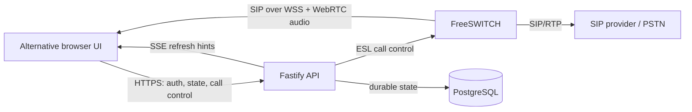

# Frontend API Integration Guide

This guide is for a team building an alternative web interface for Outbound Dialer. It explains the integration behavior that is not obvious from request and response schemas alone.

The complete, deployed API contract remains the OpenAPI 3.1 document:

- Swagger UI: `https://<dialer-host>/api/docs/`
- OpenAPI JSON: `https://<dialer-host>/api/docs/json`

Both documentation endpoints require an authenticated administrator. The OpenAPI document is the source of truth for endpoint parameters, request bodies, response bodies, and documented HTTP status codes. This guide is the source of truth for how those endpoints, browser SIP/WebRTC, and live refresh signals must be combined into a working frontend.

## 1. Integration at a Glance

The frontend is not only an HTTP client. An Agent Desk implementation has three connections:



The responsibilities are intentionally separated:

- The API owns authorization, campaign rules, contact eligibility, suppression, call control, and durable call state.
- FreeSWITCH owns SIP signaling and RTP media.
- The browser registers as a SIP/WebRTC endpoint and receives an inbound SIP `INVITE` when the API starts an agent call.
- PostgreSQL-backed API responses are authoritative for workflow state and final outcomes.
- SSE events are refresh hints. They are not a replacement for fetching current state.

Do not connect a client directly to PostgreSQL or FreeSWITCH ESL. Do not originate PSTN calls directly from SIP.js. Start and control calls through the HTTP API.

## 2. Recommended Deployment Shape

The supported production shape serves the UI, HTTP API, and FreeSWITCH WebSocket from one HTTPS host:

```text
https://dialer.example.com/                  frontend
https://dialer.example.com/api/*             HTTP API
wss://dialer.example.com/freeswitch-ws       SIP/WebRTC signaling
```

For an alternative frontend, the simplest and safest option is to deploy it behind the existing proxy at the application origin and continue using:

```ts
const API_BASE_URL = "/api";
```

This preserves:

- the HttpOnly session cookie;
- native credentialed `EventSource`;
- microphone permission under the existing HTTPS origin;
- the existing Content Security Policy and WSS routing;
- relative media-ticket URLs.

### A frontend on another origin

A separate browser origin requires deployment changes:

1. Add the exact origin to `CORS_ORIGINS`. Wildcard origins are not compatible with credentialed requests.
2. Keep `PUBLIC_APP_URL` and the proxy/TLS configuration aligned with the actual application URL.
3. Send `credentials: "include"` on cookie-authenticated requests.
4. Verify the `SameSite=Strict` session cookie behavior for the chosen domains. A truly cross-site frontend should use Bearer authentication for HTTP calls.
5. Account for native `EventSource` not supporting a custom `Authorization` header. Use the session cookie on a compatible site, or use a fetch-based SSE client that can send a Bearer header. Never put the token in the query string.
6. Allow the API and WSS destinations in the frontend's Content Security Policy.

The current nginx `Permissions-Policy` allows microphone access only to the application origin. A separately hosted frontend needs an equivalent secure-origin policy.

## 3. Contract and Compatibility

The API currently uses unversioned paths such as `/api/agent/desk`; there is no `/v1` prefix. Treat the deployed OpenAPI document as release-specific.

Recommended client workflow:

1. Sign in as an administrator.
2. download `/api/docs/json`;
3. validate or generate client types from that exact document;
4. pin the generated client to the deployed application release;
5. repeat the generation and compatibility checks before upgrading the server.

The repository also contains the TypeScript contracts used by the first-party frontend:

- `packages/shared/src/index.ts` — shared request and response types;
- `apps/web/src/api.ts` — reference HTTP and SSE client;
- `apps/web/src/softphone.ts` — reference Agent Desk SIP/WebRTC behavior;
- `apps/web/src/supervisor-softphone.ts` — reference administrator monitoring behavior.

The package is private to this monorepo, so external consumers should generate types from OpenAPI or copy a deliberately versioned subset into their own client. Do not import source files directly from a production checkout.

### Fetch the OpenAPI document

Cookie-authenticated example:

```bash
APP_ORIGIN="https://dialer.example.com"

curl --fail-with-body \
  --cookie-jar session.cookies \
  --header "Content-Type: application/json" \
  --data '{"email":"admin@example.com","password":"replace-me"}' \
  "${APP_ORIGIN}/api/auth/login"

curl --fail-with-body \
  --cookie session.cookies \
  --output outbound-dialer.openapi.json \
  "${APP_ORIGIN}/api/docs/json"
```

Treat `session.cookies`, the returned token, and SIP provisioning responses as secrets. Keep the generated specification as a controlled client-build artifact, and do not commit populated credentials.

## 4. Authentication and Sessions

### Login

`POST /api/auth/login`

```json
{
  "email": "agent@example.com",
  "password": "correct horse battery staple"
}
```

Successful login:

- returns `{ "token": "...", "user": { ... } }`;
- sets the HttpOnly `outbound_dialer_session` cookie;
- uses the same expiration window for the JWT and cookie;
- may return `429` after too many attempts. Respect the `Retry-After` header.

### Browser authentication: recommended

Use the HttpOnly cookie and do not persist the returned JWT in `localStorage`:

```ts
type LoginResponse = {
  token: string;
  user: {
    id: string;
    email: string;
    name: string;
    role: "agent" | "admin";
    isActive: boolean;
  };
};

async function login(email: string, password: string): Promise<LoginResponse> {
  const response = await fetch("/api/auth/login", {
    method: "POST",
    credentials: "include",
    headers: { "Content-Type": "application/json" },
    body: JSON.stringify({ email, password })
  });
  if (!response.ok) throw await toApiError(response);
  return response.json();
}
```

Cookie-authenticated unsafe methods (`POST`, `PUT`, `PATCH`, and `DELETE`) must include an allowed browser `Origin`. Browsers add this automatically. Do not strip it in an intermediate proxy.

### Non-browser authentication

Send the token returned by login as:

```http
Authorization: Bearer <token>
```

Bearer authentication takes precedence over the session cookie. Bearer-authenticated mutations do not require the cookie CSRF origin check.

Do not log the token, store it in source code, place it in a URL, or expose it to an audio/media element.

### Restore and end a session

- `GET /api/auth/me` restores the authenticated user after a page load.
- `POST /api/auth/logout` clears the browser cookie and returns `204`.
- Logout does not revoke a separately retained Bearer JWT. A Bearer client must discard its token locally.
- A password reset, user deactivation, or other auth-version change invalidates existing tokens.
- Treat any `401` as an expired or revoked session: stop SIP registration, close SSE, clear in-memory user state, and return to sign-in.
- Treat `403` as an authenticated user lacking the required role.

## 5. A Small HTTP Client

The API normally returns JSON. `204`, CSV, PCAP, audio, and SSE endpoints are exceptions.

```ts
export class ApiError extends Error {
  constructor(
    message: string,
    readonly status: number,
    readonly body: unknown
  ) {
    super(message);
  }
}

async function apiFetch<T>(path: string, init: RequestInit = {}): Promise<T> {
  const hasBody = init.body !== undefined && init.body !== null;
  const isFormData = init.body instanceof FormData;
  const response = await fetch(`/api${path}`, {
    ...init,
    credentials: "include",
    headers: {
      ...(hasBody && !isFormData ? { "Content-Type": "application/json" } : {}),
      ...init.headers
    }
  });

  if (!response.ok) throw await toApiError(response);
  if (response.status === 204) return undefined as T;
  return response.json() as Promise<T>;
}

async function toApiError(response: Response): Promise<ApiError> {
  const body = await response.json().catch(() => ({}));
  const message =
    typeof body === "object" && body !== null && "message" in body && typeof body.message === "string"
      ? body.message
      : `Request failed with ${response.status}`;
  return new ApiError(message, response.status, body);
}
```

The common error body is:

```json
{
  "message": "Human-readable explanation"
}
```

Validation failures also include `issues`:

```json
{
  "message": "Validation failed",
  "issues": [
    {
      "code": "invalid_string",
      "path": ["email"],
      "message": "Invalid email"
    }
  ]
}
```

Recommended status handling:

| Status        | Client behavior                                                                                 |
| ------------- | ----------------------------------------------------------------------------------------------- |
| `400`         | Show field or request validation feedback.                                                      |
| `401`         | End the local session and stop SIP/SSE connections.                                             |
| `403`         | Hide or disable the role-restricted feature.                                                    |
| `404`         | Refetch current state; the selected entity may have been removed.                               |
| `409`         | Refetch before retrying. This normally represents a workflow conflict, not a transport failure. |
| `413`         | The upload or export exceeds a configured bound.                                                |
| `416`         | The requested audio byte range is invalid. Recreate the media request.                          |
| `429`         | Respect `Retry-After`; do not automatically hammer login.                                       |
| `502` / `503` | Keep the UI state conservative and refetch. A telephony or dependency action was not confirmed. |
| `500`         | Show a generic failure with the request/call identifier; do not expose server details.          |

Never treat a timed-out HTTP request as proof that a mutation did not happen. Refetch the affected resource before offering the action again.

## 6. Live State with Server-Sent Events

Open:

```ts
const source = new EventSource("/api/agent/events", {
  withCredentials: true
});
```

The stream sends:

- `ready` once the stream is established;
- `refresh` after a relevant database notification;
- a comment heartbeat every 15 seconds;
- `retry: 3000`, allowing native reconnect after a transient disconnect.

Example:

```ts
source.addEventListener("refresh", () => {
  scheduleStateRefresh();
});

source.addEventListener("error", () => {
  markLiveUpdatesDisconnected();
});
```

Important semantics:

- The event payload contains only `source` and `occurredAt`.
- It is a signal to fetch current state, not a state transition to apply locally.
- Events are not user-scoped business objects and do not provide an exactly-once guarantee.
- Debounce bursts and ignore stale responses from earlier refresh requests.
- Keep a periodic HTTP fallback. The first-party UI refreshes general state every 30 seconds and polls Agent Desk every 2 seconds while that workflow is mounted.
- Pause background refresh application while a local mutation is in flight so an older response cannot overwrite a mutation response.
- Close the stream on logout or unmount.

## 7. Building the Agent Desk

### 7.1 Initial state

After login:

1. call `GET /api/auth/me`;
2. call `GET /api/agent/desk`;
3. select a campaign from `availableCampaigns`;
4. refetch with `GET /api/agent/desk?campaignId=<uuid>`;
5. request microphone permission;
6. fetch `GET /api/agent/softphone/provisioning`;
7. register the browser with FreeSWITCH over WSS;
8. open the SSE stream;
9. set availability with `PATCH /api/agent/availability` when the user is ready.

`AgentDeskResponse` intentionally provides the complete compact workflow model:

- current user and availability;
- selected and available campaigns;
- server-observed softphone state;
- callable leads and recent calls;
- active interactive call;
- background voicemail jobs;
- available voicemail recordings;
- action eligibility and reasons.

Keep the selected `campaignId` in every related request. Do not silently reset to the first campaign after a mutation or refresh.

Each `LeadSummary` may include `zohoLeadId: string | null`, extracted from the contact's `lead_id` (CSV or manual entry) independently of the eight-entry `fields` display limit. Preserve it as a string; never convert CRM IDs to JavaScript numbers. For a non-empty value, show a Zoho CRM link to `https://crm.zoho.com.au/crm/org7002688441/tab/Leads/{encoded ID}` with `target="_blank"` and `rel="noopener noreferrer"`. Hide the link when the property is absent, null, or blank (including when talking to an older API).

### 7.2 Availability

```http
PATCH /api/agent/availability
Content-Type: application/json

{
  "status": "available",
  "campaignId": "3b3fdbcc-38e4-45af-8d66-74d5d621f44b"
}
```

Clients may request `available` or `paused`. `wrap_up` is a server-managed state.

Pause is allowed during an active call. It does not end or alter that call; it prevents the next automatically advanced call. Resume may still be rejected until the current call is terminal. Always render the returned `AgentDeskResponse`.

### 7.3 Start calls

Available start operations:

- `POST /api/agent/call-next`
- `POST /api/agent/leads/:contactId/call`
- `POST /api/agent/manual-dial/start`

Disable start controls unless:

- SIP registration is confirmed;
- microphone permission is available;
- agent availability is `available`;
- no call-start request is in flight;
- the server reports no conflicting active call;
- the selected campaign permits the requested action.

The API enforces these rules again. UI checks are only usability guards.

#### Call the next eligible lead

```json
{
  "campaignId": "3b3fdbcc-38e4-45af-8d66-74d5d621f44b"
}
```

#### Call a selected lead

Normally send an empty object:

```json
{}
```

Calling a completed lead or one still in retry cooldown requires explicit user confirmation and the corresponding flag:

```json
{
  "confirmCompletedLead": true,
  "confirmRetryWait": false
}
```

Do not set these flags preemptively. They are deliberate, user-visible overrides.

#### Manual dialing

First call `POST /api/agent/manual-dial/validate`:

```json
{
  "phoneNumber": "+12025550123",
  "campaignId": "3b3fdbcc-38e4-45af-8d66-74d5d621f44b"
}
```

Render the normalized number and checks. Only then call `/agent/manual-dial/start` with the same input. The backend remains authoritative for normalization, validation, campaign policy, and suppression.

Do not implement an independent permissive phone regex in the new frontend.

### 7.4 What happens after a start request

The call sequence is:

1. The browser sends an HTTP call-start request.
2. The API creates and owns the durable call.
3. FreeSWITCH sends an inbound SIP `INVITE` to the registered browser agent.
4. The browser accepts the invitation with audio-only WebRTC.
5. FreeSWITCH originates the customer leg and bridges media when appropriate.
6. ESL events update durable state.
7. SSE and polling prompt the frontend to fetch the latest Agent Desk response.

The first-party client auto-accepts the trusted inbound Agent Desk invitation. If the alternative frontend adds an answer button, account for API originate watchdog timeouts and test the entire timing path.

Do not mark a call answered because SIP registration succeeded, the browser accepted its agent-leg invitation, or the HTTP start request returned `200`. Use the backend `activeCall.state`, `activeCall.status`, and terminal outcome.

### 7.5 Active-call controls

- End: `POST /api/agent/calls/:callId/end`
- DTMF: `POST /api/agent/calls/:callId/dtmf`
- Voicemail drop: `POST /api/agent/calls/:callId/drop-voicemail`
- Final status override: `PUT /api/agent/calls/:callId/status`

The first three call-control endpoints return a refreshed `AgentDeskResponse`. The final status override returns `ManualCallStatusResponse`.

Render `activeCall.actions.dropVoicemail` and `activeCall.actions.sendDtmf` directly:

```ts
type CallActionAvailability = {
  allowed: boolean;
  reason: string | null;
};
```

Do not reproduce the eligibility rules in the frontend. Disable the control when `allowed` is false and show `reason`.

Allow only one call-control mutation at a time. Repeated `Hang up`, `DTMF`, or `Drop voicemail` requests can race real telephony events.

The first-party Agent Desk includes forensic context with every `Hang up` request:

```json
{
  "campaignId": "11111111-1111-4111-8111-111111111111",
  "clientContext": {
    "initiator": "agent_desk_hangup_button",
    "browserEventTrusted": true,
    "clientTimestamp": "2026-08-07T08:00:00.000Z",
    "pagePath": "/agent?view=desk",
    "visibilityState": "visible",
    "activeCallStatus": "ringing",
    "softphoneCallState": "active"
  }
}
```

`clientContext` remains optional for backward-compatible API clients. The API durably stores it on the
`call_ended` timeline event together with the authenticated actor, previous call state, server receive time,
request ID, source IP, auth transport, User-Agent, Origin, Referrer, and Fetch Metadata headers. A missing
`clientContext` therefore identifies an API or legacy-client request with no first-party UI click evidence.
`browserEventTrusted` records the browser's `Event.isTrusted` value: it distinguishes a normal browser click
from a synthetic DOM event, but it is forensic evidence rather than cryptographic attestation because a custom
API client can construct its own request body.

DTMF accepts one supported digit per request. Consult the OpenAPI schema for the exact allowed values.

After a call has ended, its authenticated owner may correct the terminal result once:

```json
{
  "outcome": "answered"
}
```

The endpoint rejects active calls. Repeating the same `PUT` is idempotent, but a different later outcome returns `409`: the first manually set result is permanently locked against subsequent API calls and late or replayed FreeSWITCH events.

### 7.6 Voicemail drop

Send a selected recording or omit `recordingId` to use the configured default:

```json
{
  "campaignId": "3b3fdbcc-38e4-45af-8d66-74d5d621f44b",
  "recordingId": "34f55ed9-568a-4a79-bd61-39f77b6db871"
}
```

After playback starts, the agent leg may be released while the customer leg continues as a background voicemail job. The agent can begin another interactive call, but the previous job is not successful until its status becomes terminal.

Do not interpret `requested` or `playing` as delivered. Even `completed` proves local playback completion, not that a far-end mailbox stored the complete message.

### 7.7 Auto-advance

`campaign.autoAdvanceToNextLeadEnabled` is a client-visible policy. The first-party frontend implements it by calling `/agent/call-next` once when:

- a previous non-manual active call disappears from the refreshed state;
- the setting is enabled;
- callable leads remain;
- the agent is not paused;
- the softphone is registered;
- no other start request is running.

Manual calls do not auto-advance. Track the previous call ID and guard against duplicate effects after rerenders or repeated SSE/poll responses.

## 8. SIP/WebRTC Integration

The provisioning response contains operational SIP and ICE credentials:

```ts
type SoftphoneProvisioningResponse = {
  sipUri: string;
  sipUsername: string;
  sipPassword: string;
  displayName: string;
  websocketUrl: string;
  domain: string;
  iceServers: Array<{
    urls: string[];
    username?: string;
    credential?: string;
  }>;
};
```

Treat this entire response as secret. Keep it in memory, never log it, and discard it on logout.

The first-party implementation uses SIP.js. A simplified registration outline is:

```ts
import { Registerer, RegistererState, SessionState, UserAgent } from "sip.js";

const provisioning = await apiFetch<SoftphoneProvisioningResponse>("/agent/softphone/provisioning");
const uri = UserAgent.makeURI(provisioning.sipUri);
if (!uri) throw new Error("Invalid SIP URI");

const userAgent = new UserAgent({
  uri,
  displayName: provisioning.displayName,
  authorizationUsername: provisioning.sipUsername,
  authorizationPassword: provisioning.sipPassword,
  transportOptions: {
    server: provisioning.websocketUrl
  },
  sessionDescriptionHandlerFactoryOptions: {
    peerConnectionConfiguration: {
      iceServers: provisioning.iceServers
    },
    constraints: {
      audio: true,
      video: false
    }
  },
  delegate: {
    onInvite: async (invitation) => {
      invitation.stateChange.addListener((state) => {
        if (state === SessionState.Established) {
          attachRemoteAudio(invitation);
        }
        if (state === SessionState.Terminated) {
          clearRemoteAudio();
        }
      });
      await invitation.accept({
        sessionDescriptionHandlerOptions: {
          constraints: { audio: true, video: false }
        }
      });
    }
  }
});

const registerer = new Registerer(userAgent);
registerer.stateChange.addListener((state) => {
  if (state === RegistererState.Registered) {
    // The browser is ready for API-started calls.
  }
});

await userAgent.start();
await registerer.register();
```

Production code must additionally handle:

- explicit microphone permission before registration;
- chosen input/output devices and audio-processing constraints;
- registration timeout and rejected `REGISTER`;
- WSS disconnect and re-registration;
- only one current invitation;
- stale async work after logout, route change, or user change;
- remote audio autoplay rejection with a user-gesture retry;
- `RTCRtpReceiver` tracks attached to an `HTMLAudioElement`;
- stopping tracks, unregistering, and closing the user agent on cleanup;
- ICE/TURN configuration exactly as returned by provisioning;
- browser media telemetry.

The trusted Agent Desk invitation includes:

```text
X-Outbound-Dialer-Call-ID: <call UUID>
```

Validate this header before associating WebRTC telemetry with a call.

### Browser media telemetry

`PUT /api/agent/calls/:callId/browser-media` accepts a cumulative, bounded WebRTC summary for the authenticated agent's call. The first-party client samples `RTCPeerConnection.getStats()` every 5 seconds, uploads every 6 samples, and submits a final snapshot on termination.

Telemetry does not control the call, but omitting it reduces administrator visibility into packet loss, jitter, RTT, codecs, ICE path, concealment, and suspected one-way audio.

Use the OpenAPI schema for `BrowserMediaTelemetryRequest`; do not submit raw unbounded stats reports.

## 9. Call State Model

Durable call states are:

```text
created
agent_ringing
agent_answered
customer_dialing
customer_ringing
bridged
voicemail_signal_detected
voicemail_drop_requested
voicemail_playback_started
agent_released
voicemail_playback_completed
completed
failed
canceled
```

Terminal outcomes are:

```text
answered
not_answered
busy
failed
voicemail_detected
voicemail_dropped
agent_canceled
customer_hung_up
suppressed
```

Frontend rules:

- Treat the complete API response as a snapshot; do not assume every intermediate state will be observed.
- Do not derive a terminal outcome from browser audio, elapsed time, or the SIP.js dialog alone.
- Keep `callId` in support-visible diagnostics.
- A missing `activeCall` after a mutation or refresh normally means the interactive call is terminal or the agent has been released; check `recentCalls` and `voicemailJobs`.
- Never overwrite a newer snapshot with an older request response. Use request sequence numbers or cancellation.
- If `/agent/calls/:callId/status` was used, treat the returned `outcome` as final; a manual status lock cannot be replaced.

## 10. Administrator Interface

Administrator endpoints cover:

- overview and analytics;
- users;
- campaigns and contacts;
- CSV import history;
- voicemail recordings;
- suppression;
- call history, technical detail, recordings, and PCAP;
- AVMD review;
- live-call monitoring;
- runtime settings, retention, diagnostics, and audit.

Use paginated list endpoints instead of loading the compact `/admin/overview` response as a complete library. Preserve query filters in the URL so an administrator can reload or share a view safely.

### Mutations and audit

Successful mutating `/admin/*` requests are audit-recorded. The UI should require explicit confirmation for destructive or high-impact actions, especially:

- deactivating users;
- deleting campaigns or recordings;
- resetting campaign leads;
- removing suppression entries;
- changing runtime settings;
- executing retention rather than previewing it;
- joining a monitored call.

Do not automatically retry administrator mutations after a network error. Refetch first.

### Manual lead creation

`POST /admin/contacts` accepts an optional Zoho Lead ID through the existing `fields` array: `[{ "label": "lead_id", "value": "51445000042207511" }]`. The Add lead form trims surrounding whitespace, keeps the ID as a string (maximum 400 characters), and omits it when blank. The saved ID is exposed as `zohoLeadId` on subsequent Agent Desk responses, enabling the same CRM links as CSV-imported leads.

### CSV import

The API supports:

- JSON text import: `/admin/campaigns/:campaignId/import-csv`;
- multipart file import: `/admin/campaigns/:campaignId/import-csv-file`;
- multipart suppression import: `/admin/suppression/import-csv-file`.

For multipart requests, use `FormData` and let the browser set the multipart boundary. Do not manually set `Content-Type`.

Campaign CSV accepts comma or semicolon delimiters (auto-detected from the header row) and requires mapped `name` and `phone` data. The response includes an import ID and counts; use `/admin/csv-imports/:importId` to show paginated failures.

### Audio playback and media tickets

Do not put the session JWT into an `<audio>` URL.

For a call recording:

1. `POST /api/admin/calls/:callId/recording-ticket`;
2. receive `{ "url": "...", "expiresAt": "..." }`;
3. prefix the returned path with `/api`;
4. assign it to the audio element before expiration.

Voicemail recording previews use the equivalent `/admin/recordings/:recordingId/audio-ticket`.

Media endpoints support HTTP byte ranges. Obtain a new ticket after expiration or an authorization failure. Do not log ticket query strings.

PCAP and CSV endpoints return binary/text downloads rather than JSON. Handle their error response before converting the successful response to a `Blob`.

## 11. Supervisor Call Monitoring

Administrator live monitoring uses a second SIP identity. It must not reuse the Agent Desk SIP registration.

Workflow:

1. Fetch `GET /api/admin/supervisor/provisioning`.
2. Register a dedicated SIP.js user agent without microphone capture.
3. Fetch `GET /api/admin/live-calls`.
4. Start with `POST /api/admin/live-calls/:callId/supervisor`.
5. Accept the incoming supervisor `INVITE` in listen-only mode.
6. Change mode with `PATCH /api/admin/supervisor-sessions/:sessionId`.
7. Stop with `DELETE /api/admin/supervisor-sessions/:sessionId`.

Incoming supervisor invitations include:

```text
X-Outbound-Dialer-Supervisor-Session-ID: <session UUID>
X-Outbound-Dialer-Supervisor-Mode: listen | whisper | join
```

Security behavior:

- Monitoring always begins in `listen`.
- `listen` must use `audio: false` for local capture. It receives remote audio only.
- `whisper` enables microphone audio toward the agent only.
- `join` enables microphone audio toward agent and customer and requires explicit user confirmation before the API request.
- A mode change replaces the FreeSWITCH supervisor leg. The replacement invitation may arrive before the old SIP dialog reports termination, so allow a same-session handoff while rejecting unrelated simultaneous invitations.
- Stopping the supervisor session must not change the agent-customer call.

Use `apps/web/src/supervisor-softphone.ts` as the behavioral reference for this race-prone flow.

## 12. Endpoint Catalog

All paths below are relative to `/api`. Consult Swagger for exact schemas and status codes.

### Authentication and system

| Method | Path            | Purpose                           |
| ------ | --------------- | --------------------------------- |
| `POST` | `/auth/login`   | Login and set the session cookie. |
| `POST` | `/auth/logout`  | Clear the browser session.        |
| `GET`  | `/auth/me`      | Fetch the current user.           |
| `GET`  | `/health/live`  | Process liveness.                 |
| `GET`  | `/health/ready` | Dependency readiness.             |
| `GET`  | `/health`       | Compatibility readiness endpoint. |

`/metrics` is part of the internal service contract but is intentionally blocked by the public nginx proxy.

### Agent

| Method  | Path                                  | Purpose                                                   |
| ------- | ------------------------------------- | --------------------------------------------------------- |
| `GET`   | `/agent/desk`                         | Complete Agent Desk snapshot; optional `campaignId`.      |
| `PATCH` | `/agent/availability`                 | Pause/resume and return a fresh desk snapshot.            |
| `GET`   | `/agent/softphone/provisioning`       | SIP/WSS/ICE credentials.                                  |
| `GET`   | `/agent/events`                       | Credentialed SSE refresh stream.                          |
| `POST`  | `/agent/manual-dial/validate`         | Normalize and validate without calling.                   |
| `POST`  | `/agent/manual-dial/start`            | Start an allowed manual call.                             |
| `POST`  | `/agent/call-next`                    | Select and call the next eligible lead.                   |
| `POST`  | `/agent/leads/:contactId/call`        | Call a selected lead.                                     |
| `POST`  | `/agent/calls/:callId/end`            | End the interactive call.                                 |
| `POST`  | `/agent/calls/:callId/drop-voicemail` | Start voicemail playback and release the agent when safe. |
| `POST`  | `/agent/calls/:callId/dtmf`           | Send one DTMF digit.                                      |
| `PUT`   | `/agent/calls/:callId/browser-media`  | Upsert bounded browser media telemetry.                   |

### Admin overview, analytics, history, and monitoring

| Method   | Path                                    | Purpose                             |
| -------- | --------------------------------------- | ----------------------------------- |
| `GET`    | `/admin/overview`                       | Compact operational overview.       |
| `GET`    | `/admin/analytics`                      | Bounded date/campaign analytics.    |
| `GET`    | `/admin/calls`                          | Paginated/filterable call history.  |
| `GET`    | `/admin/calls/export.csv`               | Filtered CSV export.                |
| `GET`    | `/admin/calls/:callId`                  | Call detail and technical evidence. |
| `PUT`    | `/admin/calls/:callId/avmd-review`      | Create/update human AVMD review.    |
| `POST`   | `/admin/calls/:callId/recording-ticket` | Issue a short-lived playback URL.   |
| `GET`    | `/admin/calls/:callId/recording`        | Ticket-authorized byte-range audio. |
| `GET`    | `/admin/calls/:callId/pcap`             | Download an available PCAP.         |
| `GET`    | `/admin/live-calls`                     | List monitorable bridged calls.     |
| `GET`    | `/admin/supervisor/provisioning`        | Dedicated supervisor SIP identity.  |
| `POST`   | `/admin/live-calls/:callId/supervisor`  | Start listen-only monitoring.       |
| `PATCH`  | `/admin/supervisor-sessions/:sessionId` | Change listen/whisper/join mode.    |
| `DELETE` | `/admin/supervisor-sessions/:sessionId` | Stop monitoring.                    |

### Admin campaigns and contacts

| Method   | Path                                           | Purpose                                                 |
| -------- | ---------------------------------------------- | ------------------------------------------------------- |
| `GET`    | `/admin/campaigns`                             | Paginated campaign library.                             |
| `POST`   | `/admin/campaigns`                             | Create a campaign.                                      |
| `PATCH`  | `/admin/campaigns/:campaignId`                 | Update campaign policy.                                 |
| `POST`   | `/admin/campaigns/:campaignId/reset-leads`     | Reset eligibility while preserving history/suppression. |
| `DELETE` | `/admin/campaigns/:campaignId`                 | Delete an unused campaign.                              |
| `GET`    | `/admin/campaigns/:campaignId/contacts`        | Paginated campaign contacts.                            |
| `POST`   | `/admin/contacts`                              | Create and normalize a contact.                         |
| `POST`   | `/admin/contacts/:contactId/suppress`          | Globally suppress the contact number.                   |
| `POST`   | `/admin/contacts/:contactId/complete`          | Mark the contact completed.                             |
| `POST`   | `/admin/campaigns/:campaignId/import-csv`      | Import CSV supplied as JSON text.                       |
| `POST`   | `/admin/campaigns/:campaignId/import-csv-file` | Import an uploaded CSV file.                            |
| `GET`    | `/admin/csv-imports`                           | Paginated import history.                               |
| `GET`    | `/admin/csv-imports/:importId`                 | Import summary and paginated failures.                  |

### Admin users, recordings, and suppression

| Method   | Path                                          | Purpose                                    |
| -------- | --------------------------------------------- | ------------------------------------------ |
| `GET`    | `/admin/users`                                | Paginated user library.                    |
| `POST`   | `/admin/users`                                | Create admin/agent user.                   |
| `PATCH`  | `/admin/users/:userId`                        | Update identity, role, state, or password. |
| `DELETE` | `/admin/users/:userId`                        | Deactivate a user.                         |
| `GET`    | `/admin/recordings`                           | Paginated voicemail recording library.     |
| `POST`   | `/admin/recordings`                           | Upload WAV/MP3 as multipart data.          |
| `PATCH`  | `/admin/recordings/:recordingId/default`      | Make a recording the default.              |
| `POST`   | `/admin/recordings/:recordingId/audio-ticket` | Issue a preview URL.                       |
| `GET`    | `/admin/recordings/:recordingId/audio`        | Ticket-authorized byte-range audio.        |
| `DELETE` | `/admin/recordings/:recordingId`              | Delete an unused recording.                |
| `GET`    | `/admin/suppression`                          | Paginated suppression list.                |
| `POST`   | `/admin/suppression`                          | Normalize and suppress a number.           |
| `POST`   | `/admin/suppression/import-csv-file`          | Import suppression CSV.                    |
| `DELETE` | `/admin/suppression/:suppressionId`           | Remove suppression entry.                  |

### Admin operations

| Method  | Path                            | Purpose                            |
| ------- | ------------------------------- | ---------------------------------- |
| `GET`   | `/admin/system-settings`        | Read mutable runtime policy.       |
| `PATCH` | `/admin/system-settings`        | Replace mutable runtime policy.    |
| `GET`   | `/admin/freeswitch/diagnostics` | Read-only ESL/trunk diagnostics.   |
| `POST`  | `/admin/freeswitch/safe-test`   | Run non-traffic FreeSWITCH checks. |
| `POST`  | `/admin/retention/run`          | Preview or execute retention.      |
| `GET`   | `/admin/audit-events`           | Paginated mutation audit.          |

## 13. Safety Checklist

Before enabling real calls:

- [ ] The frontend is served over HTTPS.
- [ ] Login, `/auth/me`, logout, and `401` cleanup work.
- [ ] Tokens and SIP credentials never enter URLs, logs, analytics, or persistent browser storage.
- [ ] The browser registers through the provisioned WSS URL and cleans up on logout.
- [ ] Microphone permission, selected input, remote audio, and autoplay recovery are tested.
- [ ] Call controls are disabled until SIP registration is confirmed.
- [ ] Only one call-start and one call-control mutation can run at a time.
- [ ] `409`, request timeout, and stale-response paths refetch before retry.
- [ ] SSE reconnect works and periodic HTTP fallback remains active.
- [ ] Poll responses cannot overwrite newer mutation responses.
- [ ] Completed/retry-wait override flags require explicit confirmation.
- [ ] Manual calls are validated by the API before start.
- [ ] Action eligibility comes from `activeCall.actions`.
- [ ] Auto-advance runs once, excludes manual calls, and respects pause.
- [ ] Voicemail background jobs remain visible after agent release.
- [ ] Final outcomes come from backend state, not browser SIP/audio assumptions.
- [ ] Media playback uses short-lived tickets, not the session token.
- [ ] Supervisor listen mode captures no microphone.
- [ ] Join mode requires explicit confirmation.
- [ ] Realistic call-path testing covers registration, ringback/early media, two-way audio, DTMF, hangup, voicemail, reconnect, and duplicate-click prevention.
